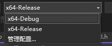
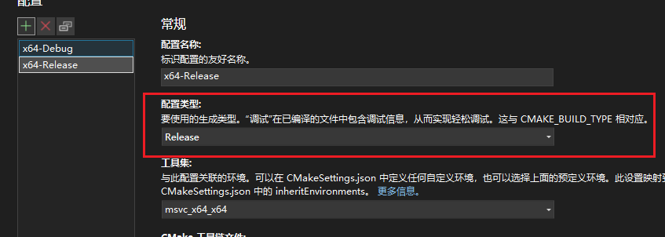
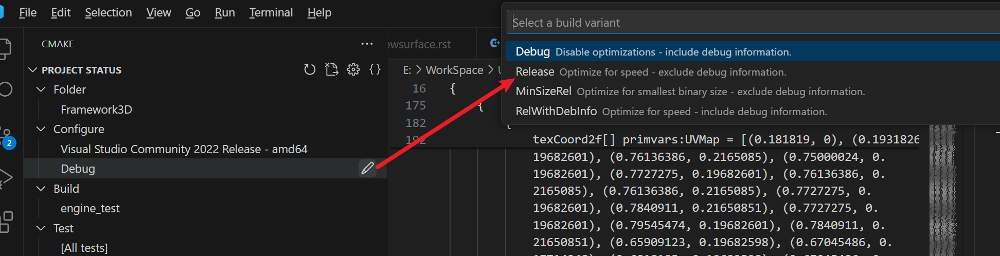
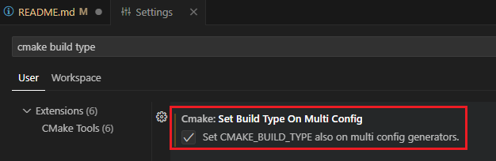

# Q&A

## 如何使用 Release 模式？

因为我们并不能假设所有同学都有支持光线追踪的显卡，本次作业使用 CPU 对光照进行计算。此过程的计算量很大，因此我们需要开启 release 模式。

在 release 模式下，我们没有办法进行断点调试，但是这时编译器会对我们的代码进行优化，改进其生成二进制代码的效率。

在 visual studio 中，我们这样开启（初始状态下，大家可能没有 x64-Release）：

在`管理配置`中，点击 + 号，并将配置类型更改为 release（默认状态会是 RelWithDebInfo）

使用 VSCode 的同学，

且需要勾选
